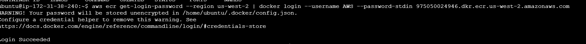
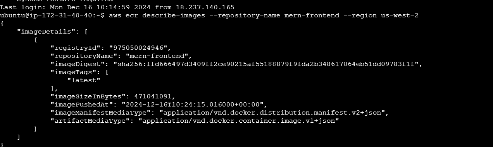
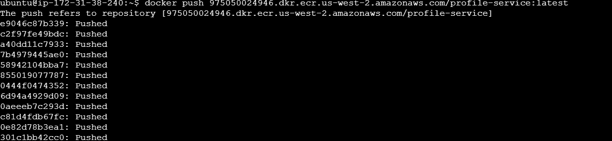
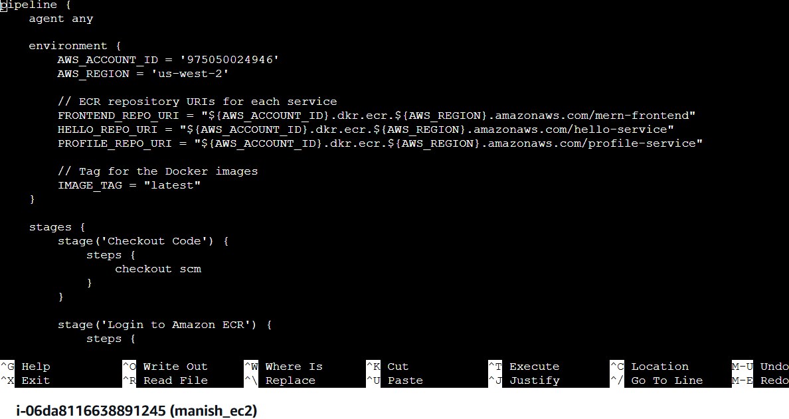
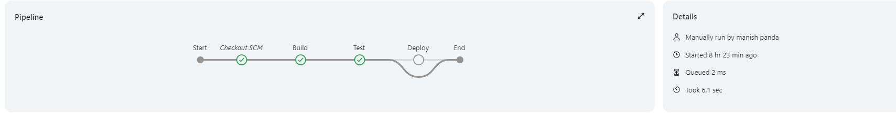
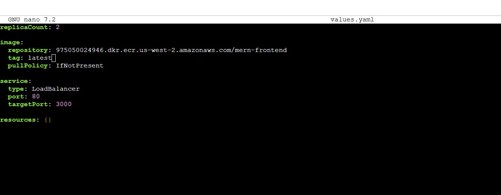

## Deploying MERN Microservices on Kubernetes with Helm

This project outlines the steps for setting up and deploying a MERN (MongoDB, Express, React, Node) application using Docker, Jenkins, AWS, and Kubernetes. The deployment follows a microservices architecture.

# Prerequisites:
1. AWS EC2 instances (t3.medium or higher) with Linux OS (Ubuntu 20.04 or later)
2. MongoDB running and configured for the backend.
3. Install Helm
4. Install kubectl
5. Set Up Kubernetes Cluster
   Use Minikube, Amazon EKS, or any Kubernetes environment.
   For EKS:
   Install eksctl:

```curl --silent --location "https://github.com/weaveworks/eksctl/releases/latest/download/eksctl_$(uname -s)_$(uname -m).tar.gz" | tar xz -C /tmp```
```sudo mv /tmp/eksctl /usr/local/bin```

6. Create an EKS cluster:
```
eksctl create cluster --name mern-cluster --region us-west-2 --nodes 3
```
7. Verify the cluster is running:
```
kubectl get nodes
```
8. Ensure you have permissions for ECR and Kubernetes management.
9. Ensure Docker is installed and running.
10.  Ensure ECR repositories exist for mern-frontend, hello-service, and profile-service.
11. Ensure your Kubernetes nodes have an IAM role with permissions to pull images from ECR.

# Architecture
Frontend: React-based application.
Backend: Nodejs Microservices
Database: MongoDB
# Deployment Steps
a. Set Up EC2 Instances Created AWS EC2 instances with t3.medium specifications. Ran the following command to update the system:
sudo apt update
Install Docker Installed Docker on EC2 instances:
docker --version
Forked the Application Repositories Cloned the provided repositories to fetch the frontend and backend codebasesStep 1: Set Up AWS Environment

Install AWS CLI and Configure Credentials:
```
sudo apt install awscli -y
```
Configured credentials:
```
aws configure
```
Provided Access Key, Secret Key, and default region.
Installed Boto3:
```
sudo apt python-boto
```
tested a boto3 script as well to get the region details and it worked fine.

b. Prepared the MERN Application
created .env files for both the subfolder of backend
ran below cmd to work with docker without sudo cmd
```
sudo usermod -aG docker $USER
```
Containerized the Application:
Created separate Dockerfile files for the frontend and backend.
Authenticate Docker to ECR
```aws ecr get-login-password --region us-west-2 | docker login --username AWS --password-stdin 9750500249.dkr.ecr.us-west-2.amazonaws.com```

Created ECR Repositories
```
aws ecr create-repository --repository-name mern-frontend
aws ecr create-repository --repository-name hello-service
aws ecr create-repository --repository-name profile-service
```

Pushed Docker Images to Amazon ECR for subfolders under backend and frontend as well:
```docker tag mern-frontend:latest 9750500249.dkr.ecr.us-west-2.amazonaws.com/mern-frontend:latest
docker push 9750500249.dkr.ecr.us-west-2.amazonaws.com/mern-frontend:latest

```


Created codecommit:
```aws codecommit create-repository --repository-name MERN-Application --region us-west-2
```
```
git remote add codecommit <CodeCommit-URL>
git push codecommit main
```
c. Jenkins for CI/CD a. Created a EC2 Instance Created a EC2 instance for hosting Jenkins web through EC2. Installed Jenkins on AWS EC2 Updated and installed Java, Jenkins, and Git on EC2 instance: For configuring we followed these below steps: Updated the package list and install Java

```
sudo apt update sudo apt install -y openjdk-11-jdk
```
Add Jenkins repository and key
```
wget -q -O - https://pkg.jenkins.io/debian/jenkins.io.key | sudo apt-key add - sudo sh -c 'echo deb http://pkg.jenkins.io/debian-stable binary/ > /etc/apt/sources.list.d/jenkins.list'
```
Install Jenkins and Git
```
sudo apt update sudo apt install -y jenkins git
wget -q -O - https://pkg.jenkins.io/debian-stable/jenkins.io.key | sudo apt-key add -
sudo sh -c 'echo deb http://pkg.jenkins.io/debian-stable binary/ > /etc/apt/sources.list.d/jenkins.list'
sudo apt update
sudo apt install -y jenkins
sudo systemctl start jenkins
sudo systemctl enable jenkins
```
Access Jenkins on http://31.24.61.68:8080. Install Plugins: 
Install the following plugins: Pipeline Docker Pipeline GitHub Kubernetes Added Docker Hub Credentials: Go to Manage Jenkins → Manage Credentials. Add a new credential with: Username:provided Docker Hub username. Password:provided Docker Hub password. ID: docker-hub-credentials. Set Up Jenkinsfile: Added a Jenkinsfile to each repository (frontend and backend's subfolders) with Groovy code for CI/CD automation.

Push the Jenkinsfile to GitHub:
```
git add Jenkinsfile
git commit -m ""
git push origin main
```
Created Jenkins Pipeline Jobs:

Go to Jenkins Dashboard → New Item. Name the pipeline (frontend-pipeline or backend-pipeline). Under the Pipeline section: Select "Pipeline script from SCM." Choose Git as SCM. Provide the repository URL and set the script path to Jenkinsfile. Set the script path to Jenkinsfile. Save the configuration.
Pipeline Stages would be something like: Start: Jenkins fetches the code from the Source Control Management (SCM) system (e.g. GitHub repository),it would pull the learnerReportCS_frontend or learnerReportCS_backend repository. Build: Jenkins builds the Docker image for the updated code. Test: Automated tests for the frontend or backend run in this stage. Deploy:This stage deploys the updated Docker image to the Kubernetes cluster. End:Marks the successful completion of the pipeline.


d. Created the VPC:

created the CIDR block for the VPC (e.g., 10.0.0.0/16).
Used Boto3's create_vpc method to create the VPC.
created subnets
subnets in different Availability Zones (AZs) for high availability.
Enabled DNS support and DNS hostname for the VPC.
Created a Security Group:
Used the create_security_group method to define inbound and outbound rules (allow HTTP, HTTPS).
set Up Load Balancer:
Used the elb client in Boto3 to create an Elastic Load Balancer (ELB) to distribute traffic across backend services.

Deployed Backend Services on EC2 Instances
Create a Launch Template:
Used create_launch_template to define the backend service instance configuration, including the Dockerized application.
Set Up Auto Scaling Group (ASG):
Use Boto3’s autoscaling client to automatically scale EC2 instances based on demand.

Deploy Frontend Services on EC2 Instances
Launch EC2 Instances:
Use run_instances to create EC2 instances for the frontend service, passing the Dockerized application as UserData.
Set Up Load Balancer:
Similar to the backend, create a load balancer for the frontend.

Created a Lambda Function for Database Backups
Backup Function:
The Lambda function connects to the database, performs a backup, and uploads it to an S3 bucket.
Deploy the Lambda Function:
Package the Lambda function as a ZIP file and deploy it using create_function.
Schedule Lambda Function:
Use EventBridge to schedule the Lambda function to run periodically (e.g., every 24 hours).


Set Up DNS with Route 53:
Use Route 53 to create a hosted zone and configure domain names for the frontend and backend services.
Associate DNS Records:
Map domain names to load balancer DNS or public IPs using A or CNAME records.

e. Used eksctl to create the cluster
eksctl create cluster --name SampleMERNCluster --region us-west-2
Deployed Application with Helm:
Createdcreated all the yaml files (chart,values,/template/deployment,services)for each service (frontend, backend(profileService,helloService). 
like this:


f. Monitored using AWS CloudWatch  the resource usage and set alarms.
  Configure CloudWatch Logs to collect application logs.


    


